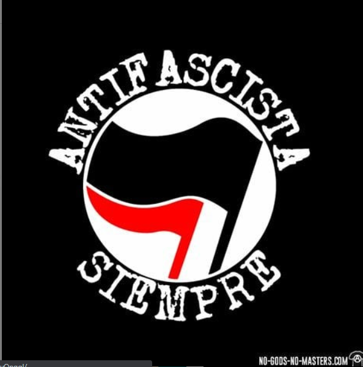
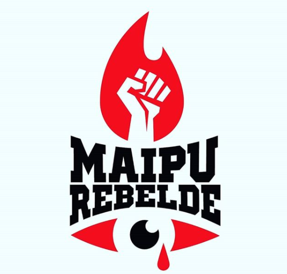
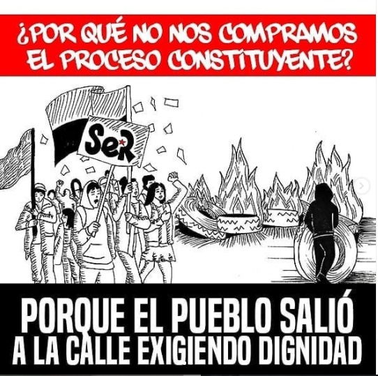
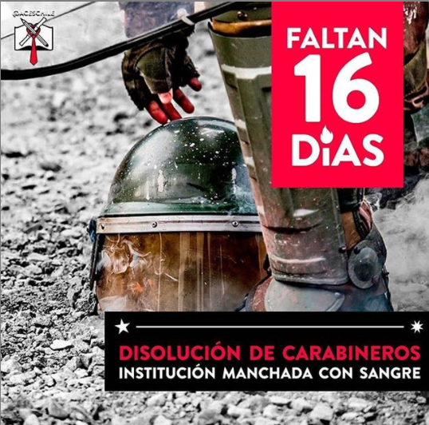
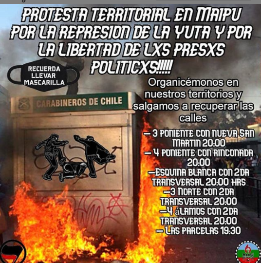

#### FOLIO: MAI01
# Maipú Rebelde

[instagram](https://www.instagram.com/p/B6ByoZnHOnY/)
[facebook](https://www.facebook.com/maipurebelde/)
[twitter]()
<correo@correo.cl>
---

### Representantes
#### No se explicita, pero según las publicaciónes la vocería es contactable por mensaje interno (dm) de instagram.

---
### Interacciones frecuentes
#### @capuchainforma1 @organicamaipu @maipudespertx2019 (la mayoría de las etiquetas son de esta cuenta) @anarquismos14 @asambleaterritoriallasparcelas

### Redes sociales
#### ¿Para qué se utiliza la red social?
| Instagram | Facebook | Twitter | Otra 
|---|---|---|---|
|Convocatoria a marchas, llamado a manifestarse, visibiliar represión policial, autoformación política|ídem Ig|-| -|

### **Instagram**
| seguidores | seguidos | publicaciones | hashtag 
|---|---|---|---|
|13.6k|263|819 (al 20/10/20)| 0

---

* **Actividad:**   

* Primera Publicación IG: 13 diciembre 2019

---
### Frecuencia de publicación.

Publicaciones: diarias (2-4 publicaciones)

Actividades: 
* Convocatoria a protestas (marchas, cacerolazos)
* Visibilización de represión policial 

---
### Ubicación
* Sector de la comuna/ciudad: Maipú

---
### Describir temas de interés y/o trabajo 
Protesta social, marchas, cacerolazos, DDHH, represión policial. 

---
### Describir la imagen ideal por la cual se trabaja.
#### (El horizonte hacia el cual se quiere avanzar.) 
Son un medio de comunicación y organización social: "somos el medio de Organización Social, Obrera y Secundaria" cuyo horizonte de lucha es visibilizar "las necesidades del pueblo, que represente a toda la comuna sin excepción ni amarillismos" y entre sus demandas claras lograr la disolución de carabineros de Chile. Por sus publicaciones y seguidores/seguidos adscriben a un ideal cercano al anarquismo. Visibilizan y comparten consignas antifascistas y antirascistas. 

---
### ¿Que se hace?
#### (Manifestaciones, marchas, intervenciones, actividades culturales, conversatorios, intercambio de saberes, actividades solidarias o de apoyo mutuo, abastecimiento, contra información, emplazamiento a autoridades etc.)
Convocatoria a protestas (marchas, cacerolazos), contrainformación, visibilización de represión policial, ayuda legal, publicación de rifas a benificio, talleres de formación. Además tienen un [link abierto "Material para formación política en cuarentena" ](https://onedrive.live.com/?authkey=%21AMArdIv9c7TBF6c&id=1B63F3B265E77E72%21136&cid=1B63F3B265E77E72) (google drive): una lista de documentales, "Marx para principiantes", "Gramsci para principiantes", "Fidel para principiantes" son algunos textos. 

---
### Describir y distinguir demandas más reivindicativas de espacios sin relación con lo contencioso o con lo político mas prefigurativo
#### (lo contencioso; demanda al Estado, a alguna autoridad, privados, etc), (prefigurativo, transformación desde lo cotidiano, etc.).

---
### Tipo de organización interna.
#### (Vocerías, asambleísmo, horizontalidad, etc.; *se entiende que esta dimensión es más difícil de captar vía análisis de redes sociales, pero quizás se puede vislumbrar a través de roles/cargos*) Vocería
---
### Describir los temas / imágenes- iconos / conceptos mas habitualmente presentes en sus publicaciones. Describir cambios/ transformaciones en los contenidos desde Octubre. 
La organización-medio de comunicación ha mantenido una línea más bien similar de videos IGTV y fotografías de represión policial, protestas,  visibilización de noticias/injusticias sociales, convocatorias a las protesta, cacerolazo, intolerancia al racismo (Mapuche), y a carabineros. 

**Iconos:**  

**Banderas:** 

**Diseño estético:**  Se utilizan mucho los colores blanco, rojo, negro, la palabra "antifascismo" y "pueblo".

> “Somos el medio de Organización Social, Obrera y Secundaria MR🔴⚫
Hasta la victoria siempre.”  (Descripción perfil de ig).   
“Somos una nueva organización de estudiantes, pobladores, vecinxs y trabajadores de Maipú. Nos vemos en la necesidad de levantar una organización que represente a toda la comuna sin excepción ni amarillismo.” (Primera publicación (13 Diciembre 2019))

---
### Percepciones que se tiene del Estado
#### (Aparato burocrático)
> La agrupación adscribe a ideales anarquistas claros, no creyendo en la vía estatal como solución a las demandas sociales, y así no confiando en el proceso constituyente actual. 

| Declaraciones | infografía | 
|--|---|
|¿Por qué no nos compramos el proceso constituyente?  |  |
|--|---|

---
### Percepciones que se tiene de las Fuerzas de Orden
#### (Aparato represivo)
> Agrupación explícitamente "anti yuta/pacos". Gran parte de su material audiovisual son videos repudiando la brutal represión policial En [una publicación 3 Octubre 2020](https://www.instagram.com/p/CF3aL_jJ5CY/) llaman a la disolución de carabineros, planteando: "Hoy tiene más sentido que nunca el porqué se tiene que disolver Carabineros: institución hecha al servicio de los ricos, quienes son capaces de golpear, gasear, torturay y mutilar en pos de la defensa de este sistema injusto y criminal. (...)  Es por eso que hoy se hace imprescindible seguir luchando por la disolución de Carabineros por un sistema más justo, por verdad y justicia para lxs multiadxs y torturadxs. El llamado es seguir luchando por una sociedad libre de toda explotación y opresión, en un mundo donde podamos tomar las decisiones de nuestrasvidas,territorios y cuerpxs."
 

| Declaraciones | Infografía | 
|---|---|
|Disolución de Carabineros "Institución manchada con sangra" (Publicación 3 Octubre 2020) |  |
|Protesta territorial en Maipú por la represión de la yuta y por la libertad a lxs presxs políticos (5 Octubre 2020)|

---
### Incorporar aca notas, citas textuales, links, etc. extra a los ya incorporados, que sean de interés para comprender tanto la forma como los contenidos asociados a la organización 
